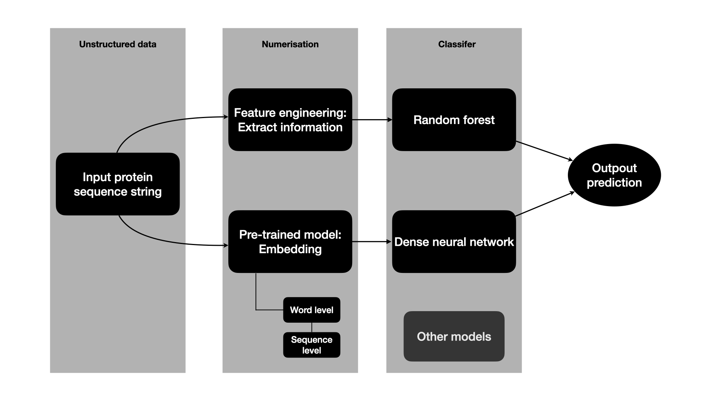
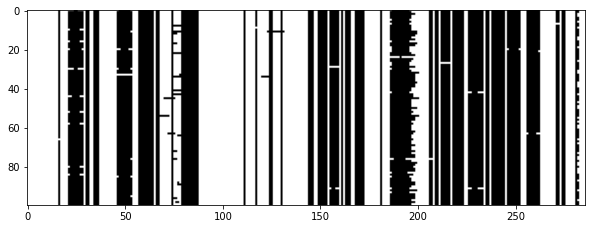

# PFam_classification
This is my solution to the [Kaggle challenge](https://www.kaggle.com/googleai/pfam-seed-random-split) protein family classification.

### Table of Content
1. Problem Description
2. Road Map
3. Data Analysis
4. Method Explanation
5. Result Analysis
6. Possible improvements

## 1. Problem Description
The goal of this exercise is to classify protein sequences into their protein family. The dataset hosted on Kaggle is divided into 3 subsets: train set (80% of total data), test set (10% of total data) and dev set (10% of total data). The division is roughly stratified according to the label’s distribution.

The data are stored in form of csv files, each having the same fields:
- sequence: string; amino acid sequence for the domain. 
- family_accession: string; protein family. The label to be predicted.
- family_id: string; unique identifier of the family accession.
- sequence_name: string; name of the sequence.
- aligned_sequence: aligned sequence with gaps (gaps represented by “.”).

## 2. Road Map
The diagram below illustrates the main steps to solve the problem.

## 3. Data Analysis
### 3.1. Basic information about the dataset
Number of unique sequences: 1086741 (training set).

Number of unique protein families: 17929 (training set), 4858 less in the test and dev sets.

### 3.2. Protein family distribution
The number of total protein families in this project is huge, much more than ordinary multi-class classification problems. But like many other similar large number categories datasets, the population distribution of the protein families is not at all uniform but rather concentrated in much fewer classes. The most populated 10% (1487 out of 13071) families contain 50% of the data in the training set.

Highly unbalanced classes increase the empirical accuracy error, and introduce more noise and confusion to the model trained to discriminate classes. In this exercise, I kept the 1487 and the 10 most populated classes for respectively the random forest model and the deep learning models, these models will be detailed in the section 4.

### 3.3. Feature engineering and analysis
**3.3.1 Classical ideas of feature engineering**

Feature engineering is a common step when variables provided in the original data are not enough informative. In this study, the only informative independent variables are the two protein sequences (aligned or not), represented in string format. This subsection describes how I extracted numerical information from these strings.

The first variable is the length of the sequence, this gives an overview of a protein sequence. 
Since a protein sequence has limited vocabulary: 25 letters representing different amino acids, it is then natural to think of computing the proportion of each amino acid in a given aligned protein sequence. Using aligned sequence for creating these variables allows to deduce the gap proportion, giving an extra insight of the structure of the protein domain.

Now a protein sequence of any length can be represented by a 27-dimensional vector: sequence length, aligned sequence length and the proportion of each of the amino acid in the aligned sequence. A useful information for the next part of the feature engineering is that the aligned sequence length is identical for proteins of the same family.

**3.3.2 A novel point of view**

Let’s now change our mindset and look at the aligned sequence in a more visual way. What if one only interests in the gaps in an aligned sequence? 
To move on in this direction, I converted the aligned sequences into binary sequences of the same length with 1 if there is some amino acid at the position and 0 if there is a gap. I then stacked these binary vectors from the same protein family to get a binary matrix. Once visualised, one can see clear patterns characterising each family.

Fig.2 is an example of such binary matrices.

It would be very informative if I can encode this visual information, and the way to do so is to convert the binary sequence to an unsigned integer. If two sequences are of the same family, the resulting integers should not be different too much. But the sequences are of length of O(100) in general, simple conversion from binary sequences will cause overflow problem. The solution is to  break a long sequence into shorter segments of length 64 (or smaller, I’m working with a 64-bit machine, hence the choice) and convert each segment. 

After padding or truncating sequences, the aligned protein strings are then represented by fix-length integer vectors

## 4. Method Explanation
I proposed two ways to tackle the problem: 
> 1. Extract useful information from the sequence then use these variables to train a random forest model. 2 sets of variables are used separately:
>>  i. Classical features (sequence length and amino acid proportions)  
>> ii. Binary encoding  

> 2. Represent the amino acid in the sequences using pre-trained protein language embedding model, aggregate the word level embedding vectors to have a sequence representation, then pass the sequence representation in a classification model (1 hidden layer of 100 units dense neural network). I implemented 3 aggregations from word to sequence:
>> i. Simple average of all word embedding vectors  
>> ii. Representation by the last hidden layer of an LSTM model  
>> iii. Maximum over channels of an 1DCNN  

The realisation of the first method is in the notebook “Feature_engineering_then_RF” and “Feature_engineering_then_RF_reducedVersion”. Lack of resources (time, teamwork…), I did not make any effort in hyper parameters tuning, so I used the default ones. The “reduced version” has less analysis part and I restricted the number of classes to 500, to compare performance of the model.

For the solution more “deep learning” flavour, I used the embedding model described in Evaluating Protein Transfer Learning with TAPE by Rao et al [2]. It is a BERT-based model trained on protein langue model tasks, the advantage of the model is that it inherits the bidirectional context aspect from BERT and the attention mechanism from the Transformer. The model embeds an amino acid into a 768 dimensional vector.

Detailed codes are in the notebooks “BERT_embedding_then_NN” and “BERT_embedding_then_NN_KO”. In the “KO” notebook I trained the BERT-embedding + LSTM + NN model, but the gain was not significant so I terminated the process.

Again, being very limited in resources (time, teammates, computation power…), I had needed to reduce the number of families even more to only the 10 most populated families for the deep learning models, and only the model using average representation has gone through my training process. 

## 5. Result Analysis
For all these methods, the model evaluation metric is the average accuracy. When training the random forest models, I randomly picked a portion of the train data and evaluated the model on the dev and test sets, and I repeated this process several times. 

A brief recap of the results:
- Nb_classes = 1487, Binary Encoding + RF: 0.972
- Nb_classes = 500, Binary Encoding + RF: 0.986
- Nb_classes = 10, Binary Encoding + RF: 1
- Nb_classes = 500, Amino acid proportion + RF: 0.985
- Nb_classes = 10, Amino acid proportion + RF: 1
-  Nb_classes = 10, BERT embedding + NN: 0.965

The random forest model trained on classical features failed when the number of classes goes up, it might be due to memory leakage because trees branches are developed using floats, and the feature space dimension is high. On the other hand the binary encoding results in rather sparse feature matrix and entries are all unsigned 64-bit integers, taking up less memory when boosting trees.

In my settings, the simpler random forest models clearly outperformed the neural network models. Explanations for the failure could be:
Hyper-parameters not properly defined (hidden layers / state dimension, number of layers…), hence negatively impact the results;
Insufficient training data compared to the number of parameters to be adjusted;
Embedding model not suited for the problem, fine tuning of the parameters needed.

A few more words on the 100% accuracy obtained by the RF models on a smaller number of classes: given the high enough dimensional feature space created by the binary encoding (or the proportion of each amino acid), the data points can be distributed sparsely yet staying in close clusters if the points belong to the same family, leaving more than enough room for the RF models to build separation thresholds between families.

## 6. Possible improvements
If time / other resources permitted, I might have tried the following:
1. If domain knowledge from experts is provided, group the families into larger classes, i.e. create hierarchical labels, then develop models by layer: classify at a larger granularity then build more refined models for smaller granularity; 
2. If domain knowledge from experts is provided, weight the labels and / or the data;
3. More of text mining on the protein sequences, for example find the k most frequent n-grams for sufficiently populated families, or other analysis based on prior domain knowledge;
4. If domain knowledge from experts is provided, change the base of the encoding from binary (gap or not) to some educated guess, for example divide the amino acids into 5 groups, each group of the amino acids has a score. When encoding, instead of using “gap or not”, use the group score might give richer information.
5. Train a protein language model from scratch that might be more adapted to the dataset and the task;
6. Cross-validate the models and find better hyper-parameters and / or try other classification models;
7.Create deep learning model checkpoints and enable warm-start for continuous model tuning.
